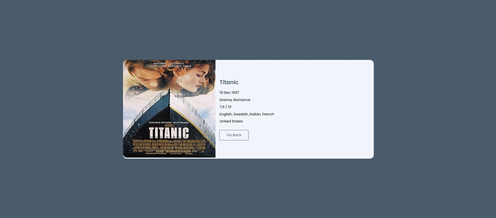

# 🎬 MovieScope - React Movie Search App

**MovieScope** is a responsive React application that allows users to search for movies and view detailed information using the OMDb API. It features real-time search, clean UI, and smooth navigation, built with a focus on simplicity and performance.

---

<!-- ## 🔗 Live Demo

[👉 View Live App](https://your-live-link.netlify.app) -->

---

## 📸 Screenshots

### 🔍 Movie Search Page  


### 🎥 Movie Details Page  


---

## ✨ Features

- Real-time movie search using the OMDb API  
- Movie cards with poster, title, and release year  
- Detailed movie view (genre, rating, plot, etc.)  
- Seamless navigation with React Router  
- Fully responsive design  
- Graceful error handling

---

## 🛠️ Tech Stack

- React.js  
- React Router DOM  
- JavaScript (ES6+)  
- HTML5 & CSS3  
- OMDb API

---

## 🔐  API Key Security


**Create a `.env` file** in your project root:

---

## 🔐 Environment Setup

### 1. Create a `.env` file in your root directory:
```env
REACT_APP_OMDB_API_KEY=your_actual_api_key_here
```

### 2. Use the API key in your React code:
```js
const apiKey = process.env.REACT_APP_OMDB_API_KEY;
fetch(`https://www.omdbapi.com/?apikey=${apiKey}&s=batman`);
```

---

## 🚫 .gitignore Configuration

Make sure you do **not** push sensitive files to GitHub:

```
.env
node_modules/
build/
```

---

## 📁 Folder Structure

```
MovieScope-react/
├── public/
├── src/
│   ├── components/
│   ├── pages/
│   ├── App.js
│   └── index.js
├── .env
├── .gitignore
├── package.json
└── README.md
```

---

## 🧪 Running Locally

### 1. Clone the repository:
```bash
git clone https://github.com/harsh-034/MovieScope-react.git 
```

### 2. Navigate into the project directory:
```bash
cd MovieScope-react
```

### 3. Install dependencies:
```bash
npm install
```

### 4. Start the development server:
```bash
npm start
```

Now open your browser and visit:  
[http://localhost:3000](http://localhost:3000)

---

## 👤 Author

**Harsh Gupta**  
💻 Frontend Developer | React Enthusiast  
📍 Mumbai, India

- 🔗 GitHub: [@harsh-034](https://github.com/harsh-034)  
- 🔗 LinkedIn: [linkedin.com/in/harsh-034](https://www.linkedin.com/in/harsh-034)

---